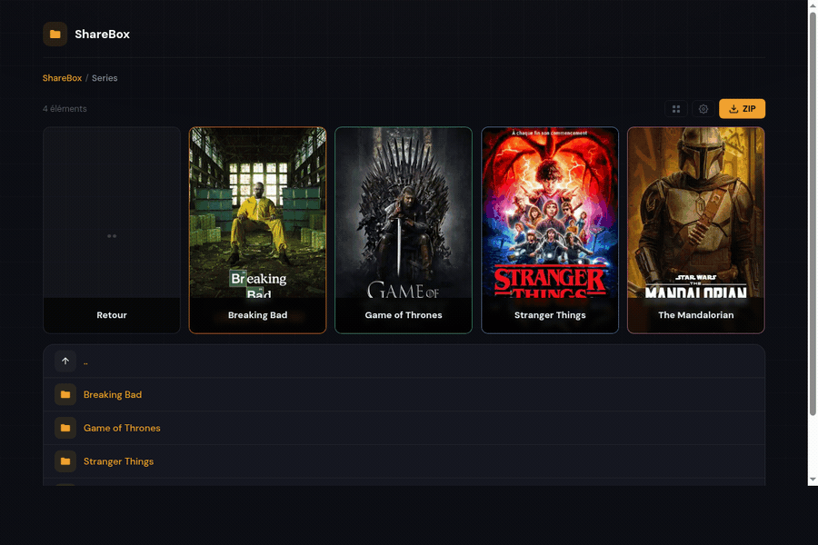

# ShareBox

**A lightweight, self-hosted alternative to Plex, Jellyfin, and Emby.**

Stream your media library instantly -- no library scan, no database server, no plugins. Just point at your files and share.

[](https://github.com/ohugonnot/sharebox/actions/workflows/tests.yml)
[](https://github.com/ohugonnot/sharebox/actions/workflows/e2e.yml)


**Looking for a Plex alternative that runs on a Raspberry Pi? A Jellyfin alternative with zero setup? A self-hosted media server you can deploy in 30 seconds?** That's ShareBox.

## Why I built this

I wanted to send a movie link to someone. That's it.

Plex wanted me to set up a media library, scan my files, create user accounts, install plugins. Jellyfin was lighter but still required a database server and metadata agents. Emby wanted a subscription. All I needed was: point at a file, get a link, let them watch.

So I built ShareBox -- a single PHP app with zero external dependencies. No framework, no accounts to create, no media library to pre-scan. You share a link, they click play, ffmpeg transcodes on the fly. It runs on a $5 VPS with 256 MB of RAM, a Raspberry Pi 4, or a Synology NAS.



## Live Demo

**[Try the demo](https://dn40904.seedhost.eu:8282/dl/browse?p=Films&view=grid)** -- no install needed. Netflix-style grid with TMDB posters, series, movies, and anime.

[Admin panel](https://dn40904.seedhost.eu:8282/share/) -- `admin` / `demo2026`

## How it compares

| | ShareBox | Plex | Jellyfin | Emby |
|---|---|---|---|---|
| **Setup time** | 30 seconds | 15-30 min | 10-20 min | 10-20 min |
| **Setup** | `docker compose up` | Database + agents + accounts | Database + metadata | Database + metadata |
| **Dependencies** | PHP + ffmpeg + SQLite | Java, database, plugins | .NET, database | .NET, database |
| **Media library scan** | None -- your filesystem | Required (hours for large libraries) | Required | Required |
| **Browse UI** | Netflix-style poster grid | Library grid | Library grid | Library grid |
| **File sharing** | Built-in: link + password + expiry | Not built-in | Not built-in | Not built-in |
| **RAM usage** | ~25 MB idle, ~50 MB streaming | 500 MB - 2 GB+ | 300 MB - 1 GB+ | 300 MB - 1 GB+ |
| **Runs on Raspberry Pi** | Yes (Pi 4, 2 GB) | Barely | Yes (Pi 4, 4 GB) | Yes (Pi 4, 4 GB) |
| **Cost** | Free (MIT) | Freemium ($5/mo) | Free (GPL) | Freemium ($5/mo) |
| **User accounts required** | No | Yes | Yes | Yes |

**TL;DR:** If you just want to share files and stream videos without maintaining a media library, ShareBox is the simplest option. If you need multi-device sync, live TV, or music management, Jellyfin or Plex are better fits.

## Quick Start

```bash
git clone https://github.com/ohugonnot/sharebox.git && cd sharebox
# Demo content included — edit docker-compose.yml to add your own media
docker compose up -d
```

Open `http://localhost:8080/share` -- done. See [Installation](#installation) for other methods.

## Features

**Grid View** -- Netflix-style poster grid powered by TMDB. Series display with season posters, movies as individual cards. AI-powered title matching (Claude Haiku) for messy filenames. Manual poster picker for corrections. Hover for plot synopsis.


**Streaming** -- 3 modes selected automatically via ffprobe:
- **Native** for H.264/MP4 (zero CPU)
- **Remux** for H.264/MKV (video copy, audio transcode to AAC)
- **Transcode** for HEVC/AV1 (libx264 ultrafast on the fly)

**GPU Transcoding** -- auto-detected. Intel VAAPI, NVIDIA NVENC, Raspberry Pi V4L2M2M. Falls back to software if no GPU. See [docs/GPU.md](docs/GPU.md).

**Player** -- custom JS video player with keyboard shortcuts, subtitle overlay (SRT/ASS -> WebVTT), PGS/VOBSUB burn-in, multi-audio track selection, quality picker (480p-1080p), episode navigation with auto-next, resume playback, Picture-in-Picture, iOS Safari HLS support.


**Sharing** -- human-readable URLs (`/dl/batman-begins-2005-x7k2`), optional password (bcrypt), expiration, folder browsing with ZIP download, QR codes, email sharing.

**Admin** -- file browser, link management, system dashboard (CPU, RAM, disk, network, temperatures, torrent activity via rtorrent SCGI).

**Under the hood** -- `flock`-based concurrency control for ffmpeg processes, SQLite probe/subtitle caching, stall watchdog with exponential backoff, keyframe-accurate seek correction, vmtouch page-cache warming.


## Contributing

ShareBox works, but there's room to improve. If you're into PHP, ffmpeg, or browser video -- here's where help would be useful:

**Known issue -- Remux mode has A/V desync.** The remux path (H.264 MKV -> MP4 without re-encoding video) produces audio drift on files with DTS/AC3 audio. It's disabled by default (`STREAM_REMUX_ENABLED = false`). Transcode works fine but costs more CPU. If you've dealt with ffmpeg `aresample` / PTS alignment, this is the one to look at -- see `handlers/stream_remux.php`.

**Other areas where PRs are welcome:**
- Feature toggles -- ability to disable streaming, subtitles, or the dashboard from `config.php`
- Extract hardcoded values (CRF, quality presets, timeouts) into configuration
- HLS improvements -- seek within an existing HLS session instead of restarting ffmpeg
- WebVTT subtitle styling (font size, position, colors)

No CONTRIBUTING.md, no issue templates. Just open a PR or an issue, keep it simple.

## Installation

> **Detailed guides** for Raspberry Pi, Synology NAS, Unraid, and more: see **[docs/INSTALL.md](docs/INSTALL.md)**

### Docker (recommended)

Edit `docker-compose.yml`:

```yaml
volumes:
  - /path/to/your/media:/media:ro
environment:
  - SHAREBOX_ADMIN_USER=admin
  - SHAREBOX_ADMIN_PASS=changeme
  - SHAREBOX_TMDB_API_KEY=your_tmdb_api_key  # optional, for poster grid
```

```bash
docker compose up -d
```

<details>
<summary>Environment variables</summary>

| Variable | Default | Description |
|---|---|---|
| `SHAREBOX_ADMIN_USER` | `admin` | Admin panel username |
| `SHAREBOX_ADMIN_PASS` | `sharebox` | Admin panel password |
| `SHAREBOX_MEDIA_DIR` | `/media/` | Media path inside the container |
| `SHAREBOX_TMDB_API_KEY` | *(none)* | TMDB API key for poster grid |
| `SHAREBOX_DEMO_DATA` | `false` | Create rich sample media (10s clips, dual audio/subtitles, TMDB posters) |
| `SHAREBOX_STREAM_MAX_CONCURRENT` | `4` | Max simultaneous ffmpeg processes |
| `SHAREBOX_STREAM_REMUX_ENABLED` | `false` | Enable remux for H.264 MKV |
| `SHAREBOX_BANDWIDTH_QUOTA_TB` | `100` | Monthly bandwidth quota (TB) |

</details>

### One-line installer (Debian/Ubuntu)

```bash
curl -fsSL https://raw.githubusercontent.com/ohugonnot/sharebox/main/install.sh | sudo bash
```

Installs PHP, ffmpeg, configures nginx or Apache, sets up HTTP basic auth.

<details>
<summary>Manual installation</summary>

```bash
git clone https://github.com/ohugonnot/sharebox.git /var/www/sharebox
cd /var/www/sharebox
cp config.example.php config.php    # edit BASE_PATH
mkdir -p data && chown www-data:www-data data
htpasswd -c /etc/sharebox.htpasswd admin
# Copy nginx.conf.example to your nginx config, reload
```

Requires: PHP 8.1+ (`pdo_sqlite`), ffmpeg, nginx or Apache.

</details>

<details>
<summary>Web server configuration</summary>

#### Nginx

Copy `nginx.conf.example` and adapt paths. Key points:
- `/share` is protected by HTTP basic auth
- `/dl/...` is public (no auth)
- `X-Accel-Redirect` serves files efficiently via sendfile
- `data/` is blocked from direct access

#### Apache

The `.htaccess` handles rewriting. Enable `mod_rewrite`, set `AllowOverride All`, and set `XACCEL_PREFIX` to `''` in `config.php` (Apache doesn't support X-Accel-Redirect).

</details>

## Security

- All database queries use prepared statements (zero SQL injection surface)
- Path traversal prevented via `realpath()` + base path validation
- Bcrypt password hashing with brute-force rate limiting
- CSRF tokens on all POST actions (`hash_equals` comparison)
- Session regeneration after authentication
- Content-Disposition header injection prevention
- Shell commands escaped with `escapeshellarg()` everywhere
- 416 tests including security-specific test cases
- PHPStan level 5 static analysis in CI

## Testing

```bash
composer install
vendor/bin/phpunit          # 416 tests, 824 assertions
vendor/bin/phpstan analyse  # Level 5
```

CI runs on GitHub Actions across PHP 8.1, 8.2, 8.3, and 8.4.

## Changelog

See [CHANGELOG.md](CHANGELOG.md) for release history.

## License

[MIT](LICENSE)
